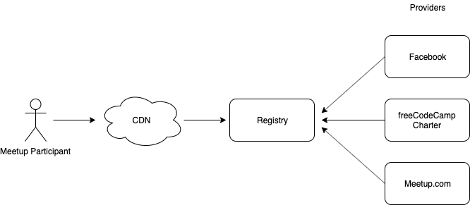

# Organiser API

The following is the draft spec for the API's used by "organiser servers" to sync data to a "public registry".

All endpoints are prefixed with `/v1/organiser/` 


## Architecture



## General Purpose API

### /organiser/api-version

Returns the current API version. This 

**type:** GET request

**Sample Response**
```
{ "api-version" : "1.0.0" }
```

## Provider API

### /organiser/provider/:serverID/set

Add or registry an organiser provider.

**type:** POST request

**Parameters:**
+ ProviderID 
+ PublicURL 

**Sample response**

### /organiser/provider/:serverID/get

### /organiser/provider/:serverID/changeKey

## /organiser/group/:groupID/set

## /organiser/group/:groupID/get

## /organiser/group/:groupID/changeKey

## /organiser/event/:eventID/set

## /organiser/event/:eventID/get


## Glossary

### Provider
Platform on which organisers create, edit and collect RSVPs for their meetups.

### Registry
Federated listing of all meetups across multiple providers.

### Organiser
Users of the meetup providers. They create the meetup on the provider platform and manage speakers and participants.

### Participant
Users of the registry who want to discover meetups.