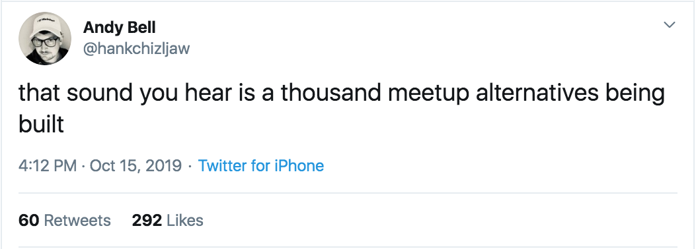

## Background Context

Meetup.com recently had a PR disaster - when rolling out a [$2 fee for every RSVP for select groups](https://web.archive.org/web/20191014205500/https://www.meetup.com/lp/paymentchanges). They have since backtracked from there, but the damage is done.

so yea ...

## User stories??

See: https://github.com/freeCodeCamp/chapter

## Dumb twitter notes

See this whole thread for back of the twitter.

https://twitter.com/bguiz/status/1185025876515160064

## List of meetup organiser

https://github.com/PicoCreator/list-of-meetup-alternatives
