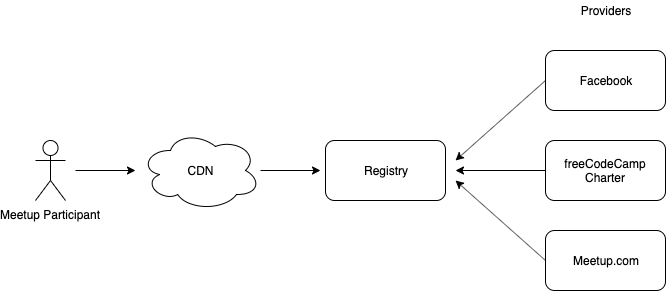

# Organiser API

The following is the draft spec for the API's used by "providers" to sync data to the "registry".

All endpoints are prefixed with `/v1/organiser/` 

---

## API Preamble

### POST-ing / editing API data

All API calls for create (POST) or edit (PUT/POST) , are required to.

- be submitted with a "request" object
- be authenticated with a public key with signature
- be submitted as JSON request with `content-type: application/json`

> Note that edit is intentionally configured to support POST, to make this easier for any developer to build on, without following REST strictly.

### Signing procedure:

To ensure requests are not modified in transit, it is needed to calculate a HMAC on the request.

1. Sort all fields in the request object recursively and serialize as a UTF-8 string.
Example library: https://www.npmjs.com/package/json-stable-stringify 
2. Use request string above and public key as inputs to HMAC. The output should be encoded as a Base64 string.
3. Put raw request, public key and hmac output (signature) into the final request object as specified below. 


**Request Format**
```
{
	"request" : {
		...
	},
	"publickey" : "...",
	"hmac" : "..."
}
```

### Object Status

All providers, groups, and events objects - go through the following registration status

| Object Status    | Description                                                                                   |
|------------------|-----------------------------------------------------------------------------------------------|
| NOT_REGISTERED   | Reserved keyword                                                                              |
| PENDING_APPROVAL | Reserved keyword - used to indicate it is registered, and pending an approval process         |
| PROVISIONAL      | Reserved keyword - used to indicate it is registered, and may or may not be visible to public |
| REGISTERED       | Indicate that the object is registered and visible to public                                  |
| BLOCKED          | Indicate that the object is blocked                                                           |

It is not required for the registry to implement all status code

---

## Architecture



## General Purpose API

### /api-version

Returns the current API version. This should be checked by implementing clients for any incomptiblity changes

**type:** GET request

**Sample Response**
```
{ "api-version" : "1.0.0" }
```

## Provider API

### /provider/:serverID/create

Add or registry an organiser provider.

**type:** POST request

**Request Object Parameters:**
| Parameter Name | Type   | Description                                          |
|----------------|--------|------------------------------------------------------|
| serverID       | String | Base 58 - GUID string to identify the server         |
| niceName       | String | Nice server name string (for administration purpose) |
| publicURL      | String | URL of the public server                             |
| publicKey      | String | Public key used to identify the server               |

**Sample response**

If registered succesfully.

```
{ "result": true }
```

If a collision error occur

```
{ 
	"error": {
		"code" : "DUPLICATE_ID",
		"message" : "Existing serverID found"
	} 
}
```

### /provider/:serverID/update

### /provider/:serverID/changeKey

## /group/:groupID/set

## /organiser/group/:groupID/get

## /organiser/group/:groupID/changeKey

## /organiser/event/:eventID/set

## /organiser/event/:eventID/get


## Glossary

### Provider
Platform on which organisers create, edit and collect RSVPs for their meetups.

### Registry
Federated listing of all meetups across multiple providers.

### Organiser
Users of the meetup providers. They create the meetup on the provider platform and manage speakers and participants.

### Participant
Users of the registry who want to discover meetups.